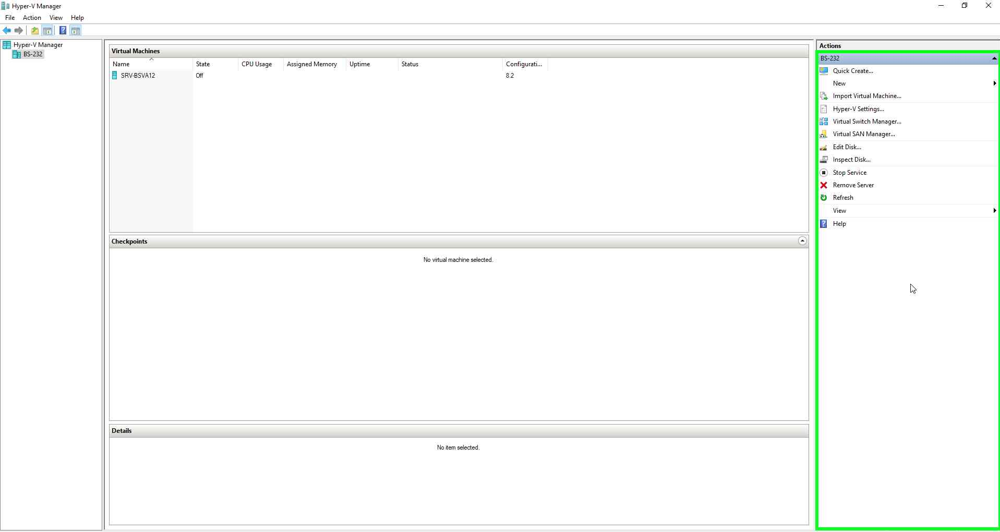
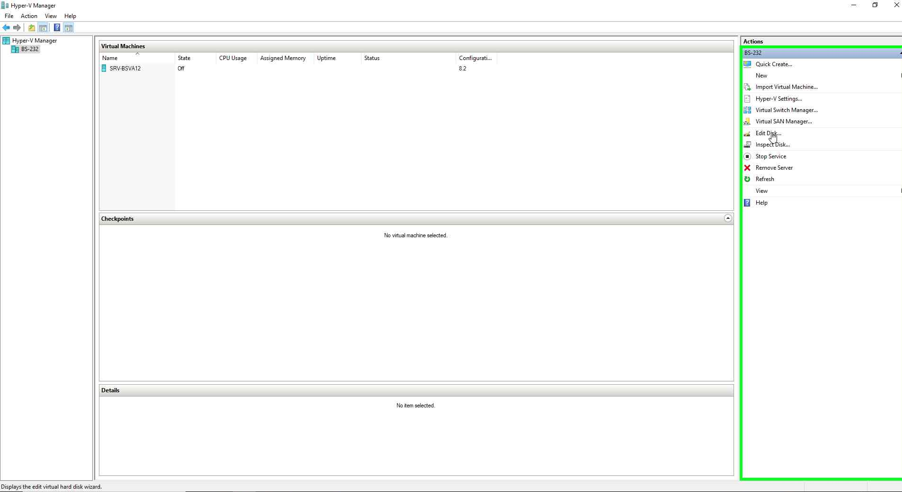
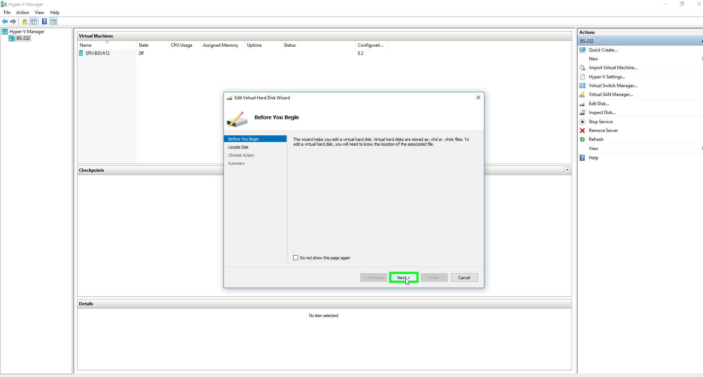
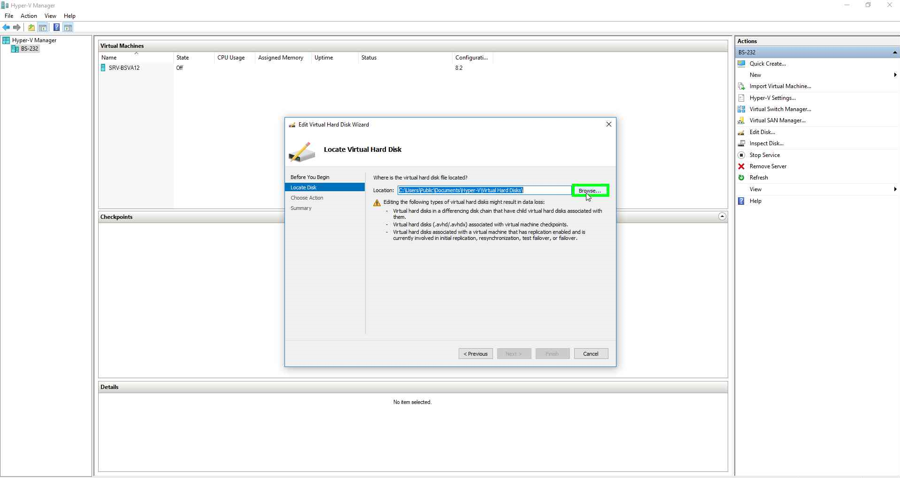
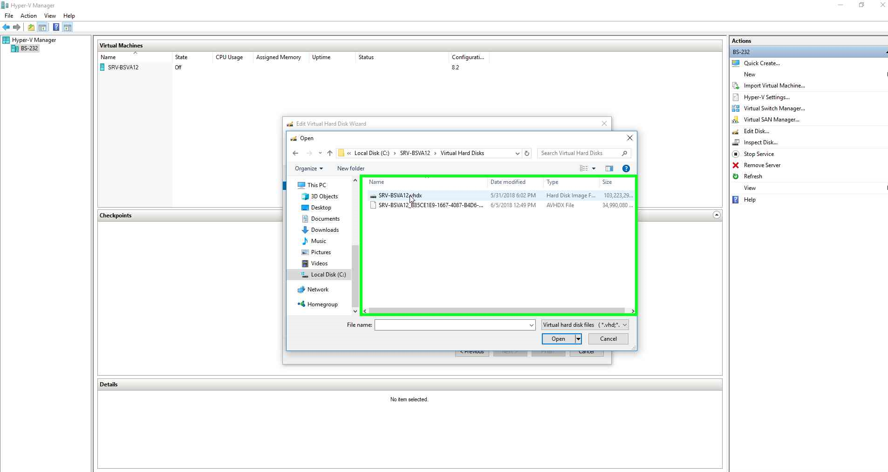
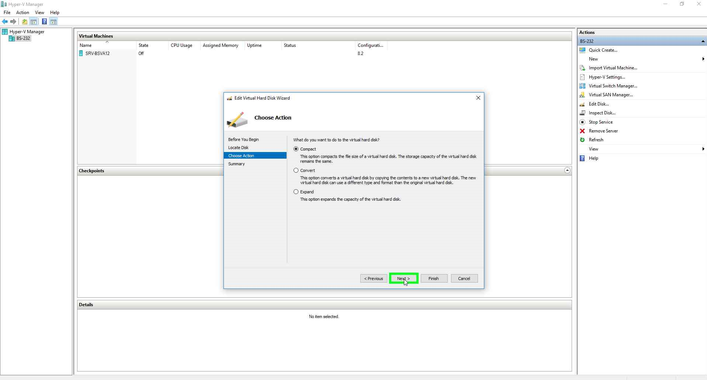
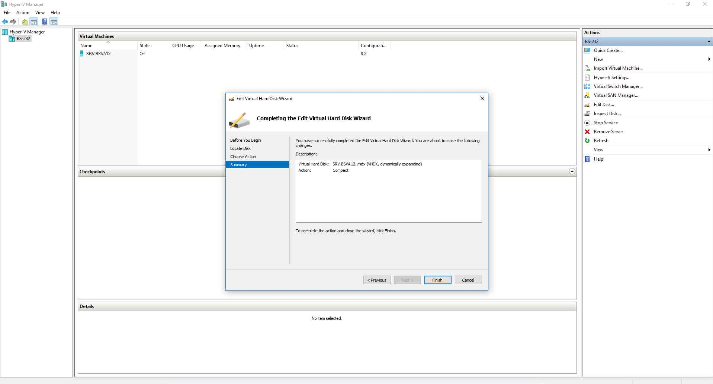

# Hyper v space compression and freeing host space

The compression process takes some time. For about 100gb on SSD it took about 15-30 min.

## steps
01. Remember to shut down your vm. Otherwisethe compress option will not appear. Only expand option is available with a running vm.

02. Click on the edit disk

03. Go to next

04. Select your virtual hard disk. In this case the .vhdx file.

05. Select compress

06. Again go to next  

07. Finally click finish and start the compression process. It might take you about 30 min.

